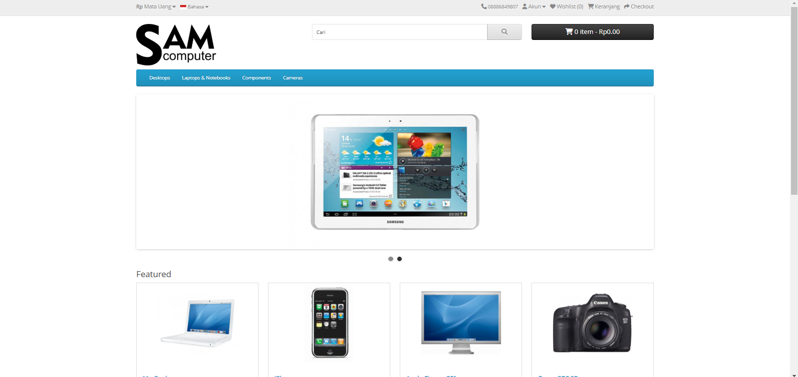
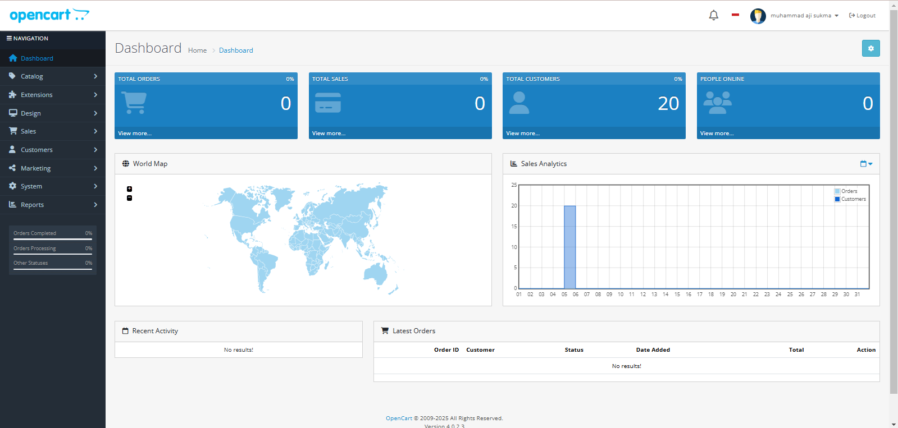

# 🎯 TRY OPENCART CMS

Selamat datang di repository mencoba OpenCart CMS! Di bawah ini adalah preview dan langkah instalasi untuk memulai.

---

## 🌐 Homepage Preview

# Sumber & lisensi sepenuhnya milik OpenCart

```
https://www.opencart.com/
```

**Tampilan Halaman Utama:**  


---

## 🛠️ Dashboard Preview

**Tampilan Dashboard Admin:**  


---

## 🚀 Instalation Guide

Ikuti langkah-langkah berikut untuk menginstal OpenCart di sistem Anda:

1. Clone repository ini:

   ```bash
   git clone https://github.com/sukmaajidigital/opencart
   ```

2. Buat database baru dengan nama `opencart_one`.

3. Import file SQL ke dalam database Anda. file sql ( [opencart_one.sql](opencart_one.sql) )

4. Sesuaikan file konfigurasi:  
   Edit [config.php](config.php) dan [login/config.php](login/config.php) ubah pada kode berikut: (sesuaikan dengan sistem anda)

   ```php
   define('HTTP_SERVER', 'http://localhost/opencart/login/');
   define('HTTP_SERVER', 'http://localhost/opencart/');
   define('DIR_OPENCART', 'C:/local/opencart/');
   ```

5. Sesuaikan file konfigurasi database di file :
   Edit [config.php](config.php) dan [login/config.php](login/config.php) ubah pada kode berikut: (sesuaikan dengan sistem anda)

   ```php
   // DB
   define('DB_DRIVER', 'mysqli');
   define('DB_HOSTNAME', 'localhost');
   define('DB_USERNAME', 'root');
   define('DB_PASSWORD', '');
   define('DB_DATABASE', 'opencart_one');
   define('DB_PORT', '3306');
   define('DB_PREFIX', 'oc_');
   ```

6. Jalankan di browser Anda:
   ```
   http://localhost/opencart/
   ```

---

💡 **Tips:** Jangan lupa untuk memeriksa folder `permissions` pada direktori proyek agar tidak ada masalah saat menjalankan aplikasi!
